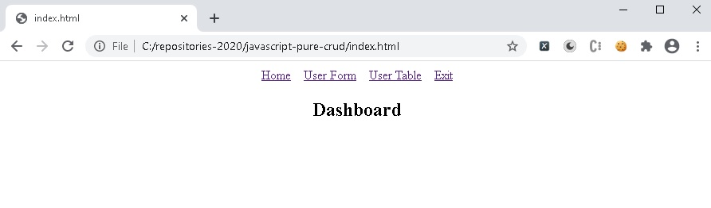
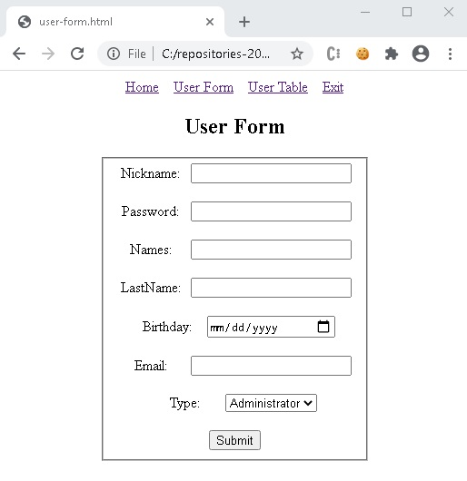
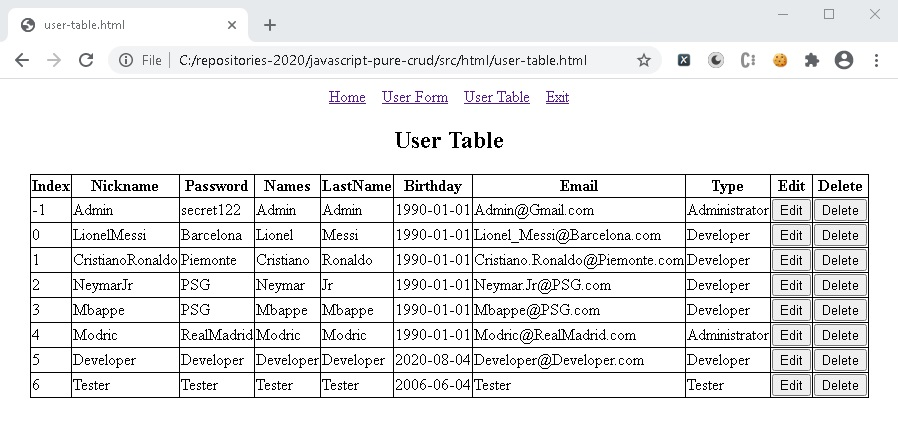

# javascript-pure-crud

This project is a very basic example of crud only with browser supported java-script

## Prerequisites 🔨

1. Install Windows 10
2. GoogleChrome

## Deploy 🚀

1. Open index.html with google chrome.

## Screens

  

  

  

  

  

## Contributing

1. Fork it!
2. Create your feature branch: `git checkout -b feature/1001`
3. Commit your changes: `git commit -m 'feature/1001: Add some feature'`
4. Push to the branch: `git push origin feature/1001`
5. Submit a pull request.

## License

- Free.
